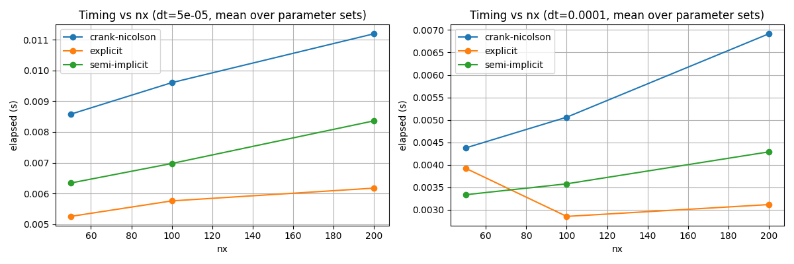
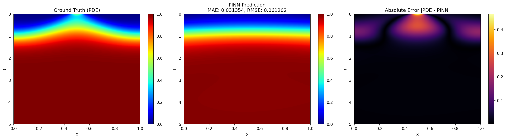
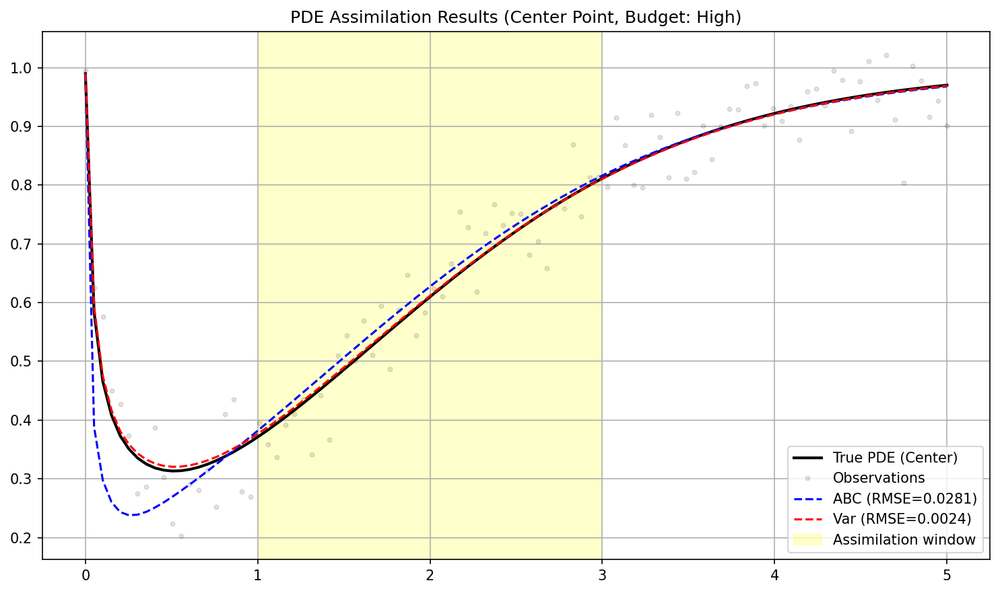
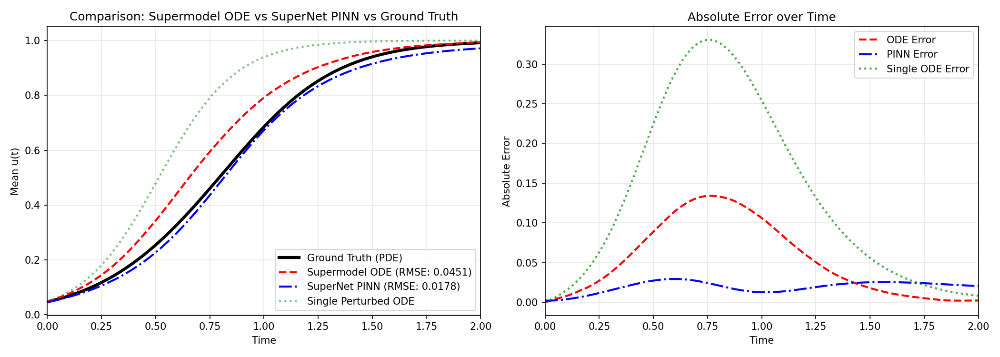

# Innovation diffusion modeling

Course project for **Informatyka systemów złożonych** (Complex Systems Informatics) at AGH University of Krakow.

**Report:** [report.pdf](report/report.pdf) · **Presentation:** [presentation.pdf](presentation/presentation.pdf)

Modeling and simulation of **innovation diffusion and market demand** as a one-dimensional reaction-diffusion system

$$u_t = D\,u_{xx} + (p + q u)(1-u)$$

where $u(x,t)\in[0,1]$ is the cumulative market share of an innovation, $D$ is spatial diffusion, $p$ the innovation rate, and $q$ the imitation rate (Bass model coupled with Fisher-KPP spatial propagation). The project walks the full modeling pipeline across seven tasks.

## Tasks

| Task | What was done | Method |
|------|---------------|--------|
| 1 | Model formulation and state of the art | Bass + F-KPP PDE, literature review |
| 2 | PDE solver comparison | Explicit Euler, semi-implicit, Crank-Nicolson (scipy.sparse) |
| 3 | Temporal surrogate models | ODE surrogate (space-averaged PDE) + feed-forward NN |
| 4 | Sensitivity analysis | Morris screening + Sobol variance decomposition (SALib) |
| 5 | Data assimilation | ABC rejection sampling + 3D-Var (scipy) |
| 6 | Physics-informed neural network | PINN with residual connections and adaptive physics weighting (PyTorch) |
| 7 | Ensemble modeling | SuperModel (coupled ODEs) vs SuperNet (coupled PINNs) |

## Key results

| Metric | Value |
|--------|-------|
| Solver timings (mean) | explicit 0.005 s, semi-implicit 0.005 s, Crank-Nicolson 0.008 s |
| Surrogate inference | ODE 0.60 ms vs NN 0.16 ms per sample |
| Sensitivity | $q$ (imitation) dominant; $D$ negligible for spatial mean |
| Data assimilation (RMSE) | ODE 3D-Var 0.0061; PDE 3D-Var 0.0017-0.0024 vs ABC 0.027-0.029 |
| PINN (MAE/RMSE) | 0.0314 / 0.0612 (vs 0.1855 / 0.2359 baseline) |
| SuperNet (MAE/RMSE) | 0.0107 / 0.0125 vs SuperModel ODE 0.0222 / 0.0451 |

Main findings: PINNs perform well with sparse noisy measurements, and the SuperNet ensemble improves robustness to parameter uncertainty beyond both a single PINN and the ODE SuperModel.

## Selected figures

| | |
|---|---|
|  |  |
| Solver timing vs grid resolution (both dt values) | PINN prediction vs ground truth and absolute error |
|  |  |
| PDE data assimilation, High budget (3D-Var in red) | SuperModel ODE vs SuperNet PINN vs ground truth |

## Repository layout

- `common/` - shared package: model, solvers, surrogates, PINN, SuperModel/SuperNet, assimilation, sensitivity, plotting
- `zad2/` - solver comparison notebook, results in `zad2/results/`
- `zad3/` - ODE surrogate + neural-network surrogate notebook
- `zad4/` - sensitivity analysis notebook (Morris, Sobol)
- `zad5/` - data assimilation notebook (ABC, 3D-Var)
- `zad6/` - PINN notebook + results
- `zad7/` - SuperModel / SuperNet notebook + results
- `report/` - LaTeX report
- `presentation/` - LaTeX presentation (metropolis theme)

## How to run

```bash
uv sync
```

- **zad2-zad7**: `jupyter lab`, open the notebook in the respective folder and run the cells (zad6/zad7 train PINNs on CPU, ~80 s and ~190 s respectively).
- The report and presentation compile with `latexmk` inside `report/` and `presentation/`.
